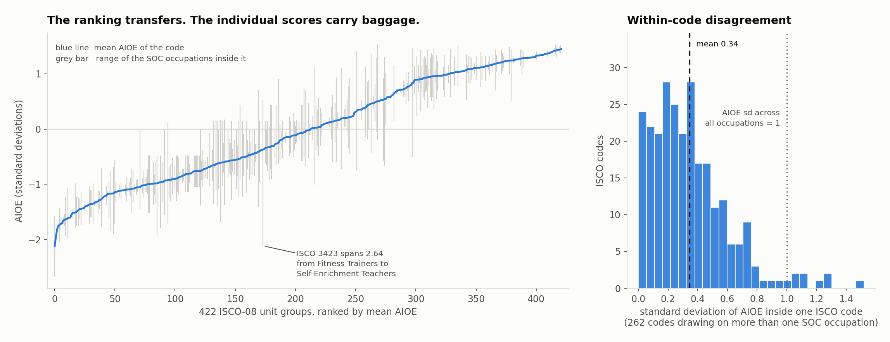
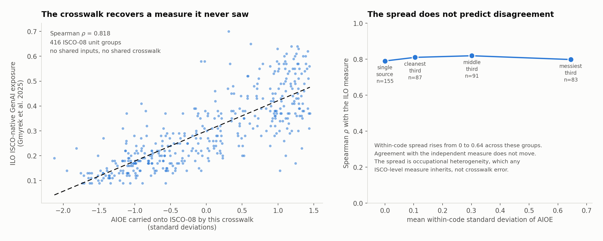

# AIOE on ISCO-08

Carrying the AIOE measure of occupational AI exposure from the United States
SOC system onto ISCO-08, and reporting how much of the AIOE ranking survives
the transfer.

Aditya Garg. Built 1 October 2026.



## Why this exists

The AIOE score of Felten, Raj and Seamans (2021) is defined on six-digit 2010
SOC codes. European labour force surveys code occupations in ISCO-08. Any
cross-country study that wants an occupation-level measure of AI exposure has
to cross that boundary, and most do not say what the crossing costs them.

Chandar and Klein Teeselink (2026) sidestep the problem by using Revelio Labs
data, which carries its own occupation and seniority codes. Asked whether that
makes the public-data crosswalk route a dead end, Robert Seamans, one of the
authors of AIOE, replied on 30 September 2026:

> I don't think it is a dead end, as the Revelio data is expensive ($10K or
> more) and so it is still useful to build a crosswalk for public data.

That is the brief. Build the crosswalk, publish it, and be honest about where
it breaks.

## Headline results

| Quantity | Value |
|---|---|
| ISCO-SOC pairs in the BLS crosswalk | 1,123 |
| Pairs carrying an AIOE score | 1,030 |
| ISCO-08 unit groups covered | 422 |
| AIOE occupations with no ISCO counterpart | 3 of 774 |
| Pairs flagged partial rather than full | 970 (86.4%) |
| ISCO codes drawing on more than one SOC code | 262 (62.1%) |
| Mean SOC codes per ISCO code | 2.44 (max 35) |
| **Share of AIOE variance lying between ISCO codes** | **0.830** |
| Mean within-ISCO standard deviation | 0.345 |
| Widest within-ISCO spread | 2.638 |
| Spearman, mean-based vs random-single-pick ranking | 0.960 |
| **Spearman vs an independent ISCO-native measure** | **0.818** [0.78, 0.85] |

AIOE is standardised to unit variance across occupations, so the within-ISCO
figures are directly readable as fractions of the whole signal.

The ranking transfers. 83 percent of the variance sits between codes, every
aggregation rule tested produces almost the same ordering, and the result
correlates at 0.818 with an exposure index built natively on ISCO-08 from
entirely separate data. That last number is the one that matters, and the
section on checking it explains why.

The within-code spread is still reported for every code, but read on before
using it as a quality filter. It does not work as one, and finding that out is
the most useful thing in this repository.

Claims this repository has withdrawn, kept here rather than quietly deleted:
that the within-code spread measures transfer error and can be filtered on, and
that coarser ISCO aggregation measurably degrades agreement. Both were tested
and neither survived.

## Using it

`out/isco08_aioe.csv` is the file most people want. One row per ISCO-08 unit
group, joined on a four-digit code held as text so leading zeros survive.

```python
import pandas as pd

cw = pd.read_csv("out/isco08_aioe.csv", dtype={"isco_08": str})
lfs = pd.read_csv("your_labour_force_survey.csv", dtype={"isco08": str})

df = lfs.merge(cw, left_on="isco08", right_on="isco_08", how="left")

# aioe_sd tells you how much the occupations inside a code disagree.
# Useful for reading one code. NOT a quality filter: the validation
# section below shows it does not predict anything.
```

| Column | Meaning |
|---|---|
| `isco_08` | Four-digit ISCO-08 unit group, as text |
| `n_soc` | How many 2010 SOC occupations feed this code |
| `n_partial` | How many of those are partial rather than full matches |
| `aioe_mean` | Mean AIOE of the contributing occupations. The headline score |
| `aioe_median` | Median, for when one outlier occupation drags the mean |
| `aioe_min`, `aioe_max` | The extremes bundled into this code |
| `aioe_sd` | Standard deviation within the code. Zero when `n_soc` is 1 |
| `aioe_range` | `aioe_max` minus `aioe_min` |
| `soc_codes` | The contributing SOC codes, pipe separated |

AIOE is standardised across occupations, so `aioe_sd` is directly comparable
to 1. A code with `aioe_sd` of 0.5 bundles occupations whose exposure differs
by half the spread of the entire measure, which matters if you are reading that
one code. It does not, as it turns out, tell you whether the code's score is
wrong.

## The problem the crosswalk has to face

The SOC to ISCO-08 mapping is many-to-many. One SOC code can feed several ISCO
codes, and one ISCO code can draw on several SOC codes. Where an ISCO code
draws on several SOC codes, those SOC codes carry different AIOE scores, and
something has to be done about the disagreement.

The usual move is to take a mean and move on. Whether that costs anything is
an empirical question, and this repository answered it wrongly at first.

ISCO 3423, fitness and recreation instructors, shows the shape of it:

| SOC | Title | AIOE |
|---|---|---|
| 39-9031 | Fitness Trainers and Aerobics Instructors | −2.112 |
| 29-9091 | Athletic Trainers | −0.331 |
| 39-1021 | First-Line Supervisors of Personal Service Workers | +0.430 |
| 25-3021 | Self-Enrichment Education Teachers | +0.526 |

The mean of those four is −0.372, and no occupation in the group is anywhere
near it. Anyone reading 3423's score as a description of one job is reading
something that describes none of them. So every row of the output ships the
spread beside the score.

The tempting next step, and the one this repository originally took, is to
conclude that 3423's score is therefore unreliable and should be dropped from
an analysis. Testing against an independent ISCO-native measure showed that
conclusion was wrong. Codes like 3423 sit no further from the independent
measure than clean ones do, because any measure defined on ISCO has to average
the same four jobs. The spread is real and worth reporting. It describes the
occupational category, not damage done by the crossing.

## Method

1. Read AIOE scores for 774 six-digit SOC codes from Appendix A of the AIOE
   data appendix. The scores are standardised: mean 0, standard deviation 1.
2. Read the BLS crosswalk and keep every (ISCO-08 unit group, 2010 SOC) pair
   together with the partial-match flag. ISCO entries shorter than four digits
   are aggregate groups rather than unit groups, and are dropped rather than
   padded into a code that means something else.
3. Attach AIOE to the SOC side of every pair.
4. Aggregate to ISCO. For each ISCO code, report the mean, median, minimum,
   maximum, standard deviation and range of the contributing AIOE scores,
   how many SOC codes contributed, how many of those were partial matches, and
   which codes they were.
5. Report the diagnostics described below.

## What the diagnostics mean

**Coverage.** How many ISCO unit groups receive any AIOE score, and how many
AIOE occupations the crosswalk never reaches. A crosswalk covering half the
ISCO space is a different object from one covering all of it, and the
difference should be stated rather than discovered later.

**Mapping degree.** The distribution of how many SOC codes feed each ISCO
code. Single-source ISCO codes carry a clean transfer. Multi-source ones
carry a blend.

**Within-code spread.** For every multi-source ISCO code, the spread of the
contributing AIOE scores. Since AIOE has a standard deviation of 1 across all
occupations, a within-ISCO standard deviation of 0.5 means the code bundles
jobs whose exposure differs by half the range of the measure.

This was originally called transfer error, on the assumption that it measured
damage done by the crossing. Validation against an independent ISCO-native
index showed that it does not. It is a property of the occupational category,
inherited by any measure defined at that level. The name was changed to match
what the number actually is.

**Variance decomposition.** A one-way random-effects decomposition of
SOC-level AIOE across ISCO groups, with

    n0 = (Σn − Σn² / Σn) / (k − 1)

as the effective group size. The reported ICC is the share of total AIOE
variance lying between ISCO codes rather than within them. It is an internal
measure, computed entirely from AIOE, so it says how much structure the ISCO
grouping preserves and nothing about whether the result is right. The external
check is the ILO comparison further down.

Near 1 means occupations folded into the same ISCO code agree
about their exposure and the ranking transfers. Near 0 means an ISCO code's
score is mostly an artefact of which SOC codes happened to land in it.

**Rank stability.** Spearman correlations between the ISCO-level rankings
produced by different aggregation rules, plus a resampling check: draw one
contributing SOC at random for each ISCO code, rank on that, and correlate
with the mean-based ranking, repeated a thousand times. A high correlation
means the choice of aggregation rule does not matter much. A low one would
mean anyone using this crosswalk is partly measuring their own arbitrary
choice.

## The weighting question, and why it is closed

Where one SOC code maps to several ISCO codes, the aggregation can be
unweighted or weighted by employment in the destination country. Weighting
needs employment counts by occupation, which differ by country, so a single
weighted crosswalk does not exist.

The data makes the question close to moot. Rankings by mean, median, minimum
and maximum correlate above 0.95 with one another, and drawing a single
contributing SOC at random for each ISCO code still reproduces the mean-based
ranking at 0.960 across a thousand draws. The aggregation rule barely moves
the ordering.

The code still supports weights through an optional
`data/oes_soc_employment.csv` with columns `soc_code` and `employment`, and
reports the weighted ranking alongside the unweighted one so the difference
stays visible.

## Data

| File | Source | Status |
|---|---|---|
| `data/aioe_soc.csv` | Appendix A of `AIOE_DataAppendix.xlsx` | committed |
| `data/AIOE_DataAppendix.xlsx` | https://github.com/AIOE-Data/AIOE | committed |
| `data/ISCO_SOC_Crosswalk.csv` | BLS, reduced to three columns | committed |
| `data/oes_soc_employment.csv` | BLS OES | optional, absent |

`data/ISCO_SOC_Crosswalk.csv` is the BLS crosswalk reduced to `isco_08`,
`soc_2010` and `match_type`. It was taken from the sheet "ISCO-08 to 2010 SOC"
of `ISCO_SOC_Crosswalk.xls`, dated August 2012 and updated June 2015, at
https://www.bls.gov/soc/soccrosswalks.htm. Dropping that original `.xls` into
`data/` also works, because the parser handles either and reads the
partial-match asterisk directly from the sheet.

The reduced CSV was produced by parsing the BLS workbook, and the figures it
yields were then reproduced independently by this Python pipeline. The two
implementations agree on every number in the table above, which is the reason
the reduced file is trusted rather than the original being required.

## Running it

```
pip install -r requirements.txt
make all
```

`make all` rebuilds the crosswalk, redraws the figure and runs the tests. The
individual targets are `make build`, `make figure` and `make test`.

Outputs land in `out/` and are committed, so the crosswalk can be used without
running anything:

- `isco08_aioe.csv` the crosswalk, one row per ISCO-08 unit group
- `soc_isco_pairs.csv` the exploded pair list with AIOE and match type attached
- `diagnostics.json` every number quoted above
- `unmatched_soc.csv` the three AIOE occupations the crosswalk never reaches

## Checking it against something that never saw AIOE

Everything above is internal. The variance decomposition, the resampling check
and the rank correlations all describe how AIOE behaves when it is moved onto
ISCO-08, but every one of them descends from AIOE, so none of them can say
whether the result is right.

Gmyrek et al. (2025), ILO Working Paper 140, built an occupational exposure
index directly on ISCO-08. It comes from Polish task descriptions scored by
1,640 workers and then by two language models. It shares no inputs with AIOE
and never touches a crosswalk. Agreement with it is therefore evidence about
the crossing rather than evidence about AIOE.



Across the 416 unit groups both measures cover, Spearman rho is **0.818**,
with a bootstrap 95 percent interval of [0.782, 0.849]. Dropping the top and
bottom 5 percent of AIOE leaves it at 0.797, so it is not an artefact of the
extremes.

The two constructs are not identical. AIOE scores exposure to AI capability;
the ILO index scores the automation potential of tasks under generative AI. So
perfect agreement was never on the table, and some of the remaining gap is
construct difference rather than transfer loss. The true fidelity of the
crossing is probably better than 0.818.

### The result that changed this repository

The within-code spread looks like transfer error. An earlier version of this
README told people to drop codes where it was large. That advice was wrong, and
the independent measure is what revealed it.

The direct test is this. Rank every code by both measures, take the absolute
rank discrepancy, and correlate it against the within-code spread. If the
spread measured damage done by the crossing, codes carrying more of it would
sit further from the independent measure.

    Spearman(within-code spread, |rank discrepancy|) = -0.032,  p = 0.51
    multi-source codes only                          = +0.009,  p = 0.89

There is no relationship. The grouped version tells the same story:

| group | n | mean within-code sd | Spearman vs ILO | 95% CI |
|---|---|---|---|---|
| single-source codes | 155 | 0.000 | 0.790 | |
| multi-source, cleanest third | 87 | 0.105 | 0.810 | [0.71, 0.88] |
| multi-source, middle third | 91 | 0.301 | 0.819 | [0.71, 0.89] |
| multi-source, messiest third | 88 | 0.645 | 0.792 | [0.71, 0.85] |

Spread rises from zero to 0.645 across those groups and agreement does not
move. The intervals overlap almost completely, so the ordering between them
means nothing and should not be read as one. Filtering the whole set at
thresholds of 0.75, 0.50, 0.35 and 0.25 moves rho to 0.821, 0.825, 0.811 and
0.805, which is noise.

The explanation is that when ISCO 3423 bundles fitness trainers with
self-enrichment teachers, the ILO's score for 3423 is also an average over
those same disparate jobs. Both measures inherit the same heterogeneity, so it
cancels rather than accumulating. The within-code spread measures how internally
varied an occupational category is. It does not measure how much the crossing
damaged the score. Those are different quantities, and this repository
conflated them until the data said otherwise.

`aioe_sd` is still worth reading when you care about one particular code. It is
not a quality filter, and nothing here should be used as one.

### Agreement at coarser ISCO levels

Cross-country employment data often arrives at 2-digit or 1-digit ISCO rather
than unit groups, so it is worth knowing whether the crossing still holds up
after aggregation.

| level | groups | Spearman vs ILO | 95% CI |
|---|---|---|---|
| 4-digit unit group | 416 | 0.818 | [0.78, 0.85] |
| 3-digit minor | 126 | 0.855 | [0.80, 0.89] |
| 2-digit sub-major | 40 | 0.843 | [0.66, 0.94] |
| 1-digit major | 9 | 0.933 | [0.48, 1.00] |

The point estimates drift upward, and it is tempting to conclude that
aggregating helps. The intervals say otherwise. They widen faster than the
estimates rise, the 2-digit interval contains the 4-digit estimate, and the
1-digit figure rests on nine groups. The supportable claim is that agreement is
indistinguishable across aggregation levels, which is still useful: working at
2-digit, as cross-country data often forces you to, costs nothing measurable.

To reproduce:

```
make validate
```

That fetches the ILO file into `data/external/`, writes `out/validation.json`
and `out/validation_pairs.csv`, and redraws the figure above. The ILO workbook
is published without an explicit licence, so it is fetched at run time rather
than redistributed here.

## The test suite

```
make test
```

Nineteen tests, and they do more than check that the code runs.

The integrity tests confirm the inputs are what this README says they are. AIOE
still has mean 0 and standard deviation 1 across 774 occupations. The crosswalk
still holds 1,123 unique pairs, split 970 partial to 153 full.

The reproduction tests re-run the pipeline and compare every published figure
against the table above, including the ICC, the within-code spread and the
thousand-draw resampling check. If a number in this README drifts from what the
code produces, the suite fails.

The method tests are the ones that matter most. A reproduction test only proves
the code still does what it did yesterday, which is no comfort if it was wrong
yesterday. So the variance decomposition is run against cases whose answers are
known in advance: groups with no internal disagreement must return an ICC of
exactly 1, groups with identical means must return 0, and synthetic data built
with a between-to-within variance ratio of 4 to 1 must recover 0.8. One test
checks that a two-digit ISCO major group is dropped rather than zero-padded
into a unit group that means something else, which is the error that would
quietly corrupt the entire mapping.

Three of the nineteen pin the validation result above, including the negative
one. If bundled codes ever start agreeing *worse* than clean ones, the suite
fails and the reasoning in this README needs revisiting. Those three skip
cleanly when `make validate` has not been run, so the core suite still works
offline.

`tests/FIXTURE_ISCO_SOC_Crosswalk.xlsx` holds invented rows in the BLS layout.
It exercises the workbook parser, it is labelled as invented, and it is never
used as data. A test asserts that the reader for the committed CSV refuses that
workbook rather than mangling it.

## Citation

If this crosswalk is useful, please cite the underlying measure and the BLS
crosswalk. This repository is a derivation of both.

## References

Felten, E., M. Raj and R. Seamans (2021). "Occupational, industry, and
geographic exposure to artificial intelligence: A novel dataset and its
potential uses." *Strategic Management Journal* 42(12).

Chandar, B. and B. Klein Teeselink (2026). "How Does AI Change Labor Demand?
Evidence from 41 Countries." Stanford Digital Economy Lab working paper,
21 September 2026.

Gmyrek, P., J. Berg et al. (2025). "Generative AI and jobs: A refined global
index of occupational exposure." ILO Working Paper 140. Scores at
https://github.com/pgmyrek/2025_GenAI_scores_ISCO08

Bureau of Labor Statistics. "Crosswalk between the 2008 International
Standard Classification of Occupations and the 2010 SOC."
https://www.bls.gov/soc/soccrosswalks.htm
